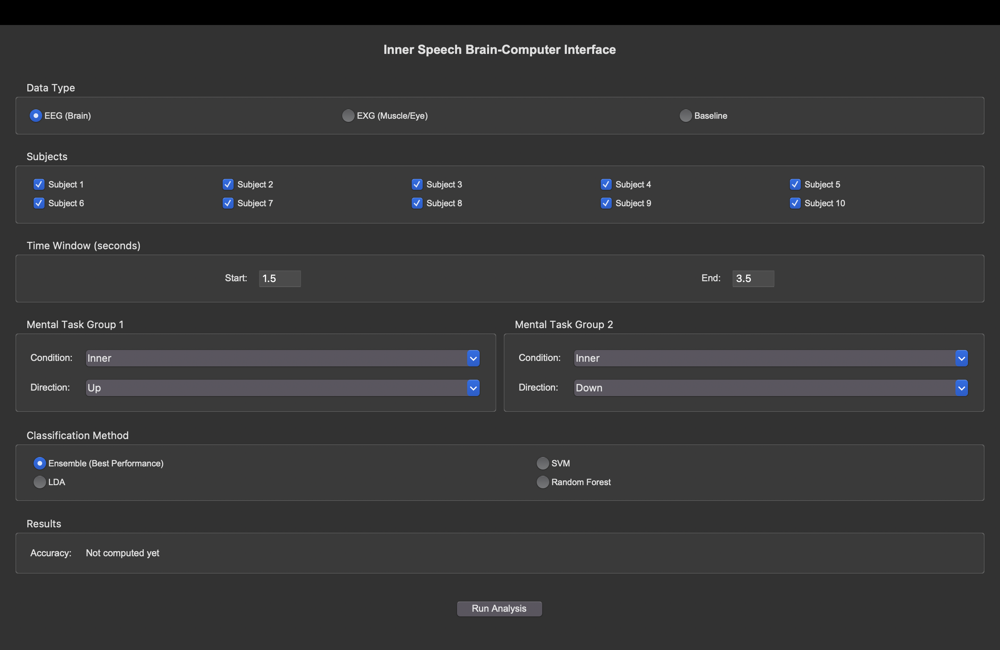
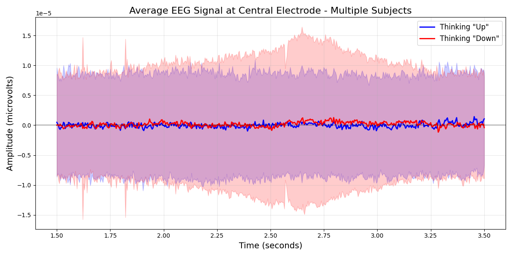
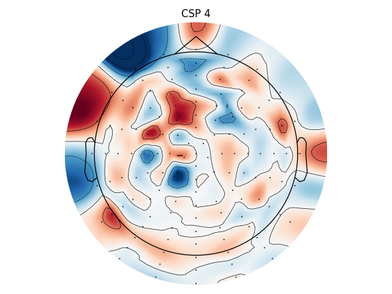
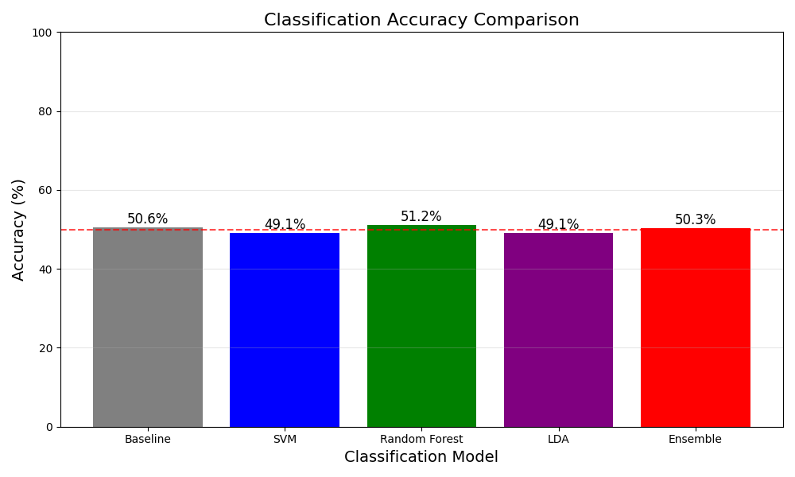
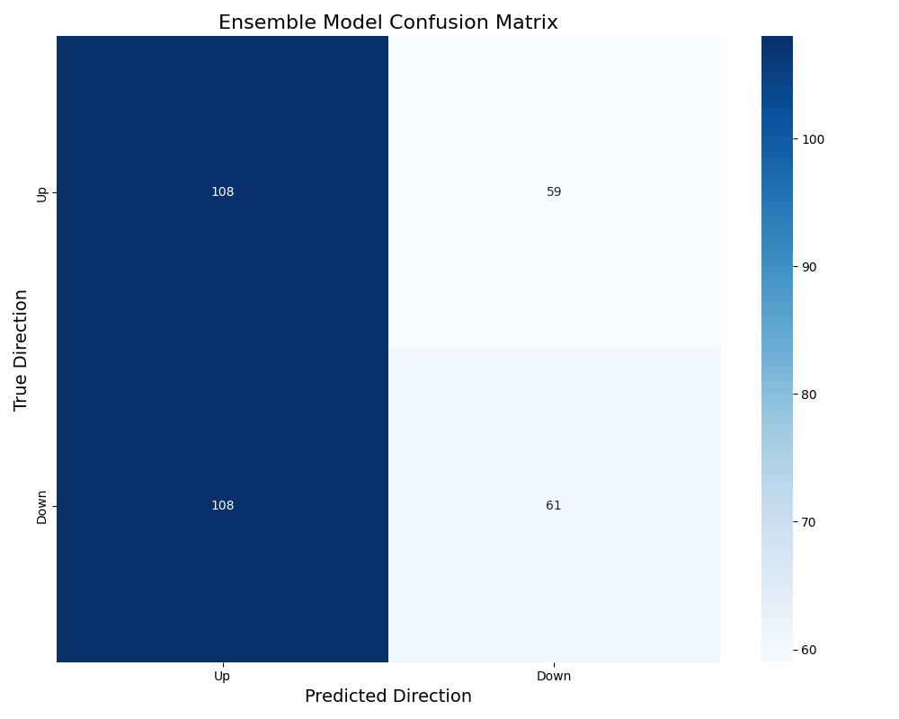

# Project Report: Decoding Inner Speech from EEG

## Neuroscience Foundation and Data Acquisition

This project aims to classify different types of inner speech (specifically directional thoughts like "Up", "Down", "Left", "Right") and related mental states using Electroencephalography (EEG) data.

**1. Data Source:**
   - We utilized the open-access "Inner Speech Dataset" (ds003626) published by Nieto et al. (2022) on OpenNeuro.
   - This dataset contains EEG recordings (128 channels, Biosemi ActiveTwo system, sampled at 2048 Hz initially, later downsampled) from 10 healthy participants performing cued mental tasks.

**2. Experimental Paradigm:**
   - Participants were presented with visual cues (e.g., arrows) and instructed to perform one of three tasks (Conditions):
      - **Inner Speech:** Mentally pronounce the direction ("Up", "Down", "Left", "Right").
      - **Pronounced Speech:** Actually pronounce the direction.
      - **Visualized:** Visualize the corresponding arrow shape.
   - The core analysis often focuses on distinguishing between the directional classes within the "Inner Speech" condition. Event markers (e.g., 31='Arriba'/Up, 32='Abajo'/Down) synchronized task events with the EEG data (#`Set_up_Marcadores.m`, #`InnerSpeech_preprocessing.py`).

**3. Neural Basis of Inner Speech:**
   - Inner speech is hypothesized to engage neural circuits overlapping with overt speech production and motor planning, potentially involving motor cortex, premotor areas, and language-related regions (often left-lateralized).
   - Decoding these subtle patterns requires careful signal processing and feature extraction sensitive to task-related modulations in brain activity.

**4. EEG Signal Processing (Neuroscience Focus):**
   - **Preprocessing (#`InnerSpeech_preprocessing.py`):**
      - *Referencing:* Data was re-referenced (e.g., to linked mastoids EXG1, EXG2) to minimize noise common to all channels.
      - *Filtering:* Notch filtering (50 Hz) removed power line noise, and band-pass filtering (e.g., 1-100 Hz) isolated physiologically relevant frequencies.
      - *Epoching:* Data was segmented into trials (epochs) time-locked to the stimulus presentation cue (e.g., -0.5s to 4s relative to cue).
      - *Artifact Handling:* Independent Component Analysis (ICA) was applied to identify and remove components strongly correlated with eye movements/blinks (EOG channels EXG1-EXG6) and potentially muscle activity (EMG channels EXG7-EXG8). An additional EMG control step (#`EMG_Control.py`) specifically targeted trials contaminated by mouth movements based on power thresholds in EXG7/EXG8 relative to baseline.
      - *Montage:* The standard Biosemi 128-channel layout was applied for topographical analysis and visualization.
   - **Time Window Selection (#`day1.py`, #`day2.py`):**
      - Analysis was often focused on a specific time window post-cue (e.g., 1.5s to 3.5s) where the cognitive task (inner speech execution) was presumed to be most active, reducing noise from pre-cue or post-task periods (#`logs/day1_devlog.md`).

**5. Feature Engineering (Neuroscience Rationale):**
   - **Frequency Domain Features (#`day1.py`, #`Archive/Tutorial_otherClassifiers.md`, #`logs/day1_devlog.md`):**
      - Mental states modulate oscillatory brain activity (brainwaves) in specific frequency bands.
      - Power Spectral Density (PSD) was calculated (e.g., using Welch's method) within standard bands like Theta (4-8Hz), Alpha (8-12Hz), Beta (12-30Hz), and Gamma (30-100Hz).
      - *Rationale:* Alpha suppression often indicates active processing, Beta is linked to motor planning/active thought, and Gamma to complex cognition. Changes in power within these bands were hypothesized to differentiate inner speech directions.
   - **Spatial Domain Features (CSP) (#`day1.py`, #`Archive/Tutorial_otherClassifiers.md`, #`logs/day1_devlog.md`):**
      - Common Spatial Patterns (CSP) is a technique specifically designed for EEG classification.
      - It finds spatial filters (linear combinations of channels) that maximize the variance (signal power) for one class while minimizing it for another.
      - *Rationale:* CSP aims to identify scalp topographies and underlying neural sources whose activity patterns are most discriminative between the mental states being compared (e.g., "Up" vs. "Down" inner speech), potentially highlighting activity in motor or language areas. The resulting CSP components represent spatially filtered signals emphasizing these discriminative patterns.

**6. Multi-Subject Analysis (#`day1.py`, #`Data_extractions.py`, #`logs/day1_devlog.md`):**
   - Data from multiple subjects (often all 10) were combined.
   - *Rationale:* While individual brain patterns vary, combining data helps identify common neural signatures associated with specific inner speech tasks, leading to more generalizable findings and models.

**7. Visualization for Neuroscientific Insight:**
   - **ERPs (Event-Related Potentials) (#`Plot_ERPs.py`):** Averaging trials for a specific condition/class reveals the time course of neural activity locked to the event cue.
   - **Topomaps (#`Plot_TRF_topomaps.py`, #`day1.py`):** Visualizing the distribution of EEG power or CSP patterns across the scalp helps infer the location of underlying neural activity.
   - **PSD Plots (#`PSD_representation.py`, #`PSD_plot_PSD.py`):** Show power distribution across different frequencies for specific conditions or channels.

This covers the main neuroscience considerations, from the data and paradigm to the specific processing and feature extraction choices made based on understanding brain activity during inner speech.

## Machine Learning Approach

Following the neuroscience-driven preprocessing and feature extraction, machine learning models were employed to classify the different inner speech directions based on the derived EEG features.

**1. Classification Task:**
   - The primary goal was multi-class classification: distinguishing between the four directional inner speech commands ("Up", "Down", "Left", "Right").
   - A secondary approach involved pairwise classification: training separate binary classifiers for each possible pair of directions (e.g., "Up" vs. "Down", "Left" vs. "Right").

**2. Feature Vector:**
   - The input to the ML models consisted of feature vectors derived from the EEG epochs.
   - **Day 1 Approach (#`day1.py`, #`logs/day1_devlog.md`):** Combined features from Power Spectral Density (PSD) across different frequency bands and Common Spatial Patterns (CSP). CSP components (typically 4-8) were calculated to maximize discriminability between classes, and their log-variance was used as features. PSD features captured frequency-specific power changes. These were concatenated into a single vector per trial.
   - **Day 2 Approach (#`day2.py`, #`logs/day2_devlog.md`):** Primarily focused on CSP features for pairwise classification, leveraging CSP's effectiveness in finding discriminative spatial filters for two-class problems.

**3. Machine Learning Models:**
   - **Linear Discriminant Analysis (LDA) (#`day1.py`, #`Archive/Tutorial_otherClassifiers.md`):** A standard, computationally efficient linear classifier often used as a baseline in EEG/BCI research due to its robustness, especially with limited data.
   - **Support Vector Machine (SVM) (#`day1.py`, #`Archive/Tutorial_otherClassifiers.md`):** A powerful classifier effective in high-dimensional spaces. A linear kernel (LinearSVC) was typically used, suitable for linearly separable or near-linearly separable data often produced by CSP.
   - **Voting Classifier (Ensemble) (#`day2.py`):** Used in the pairwise approach to potentially combine predictions from multiple base classifiers (e.g., LDA and SVM) trained on the same pair, aiming for improved accuracy and stability.

**4. ML Pipeline Implementation (using Scikit-learn & MNE):**
   - **Data Splitting:** Data was typically split subject-wise or using cross-validation folds to ensure that the model was tested on data it hadn't seen during training.
   - **Feature Scaling (#`day1.py`):** `StandardScaler` from Scikit-learn was applied to standardize features (zero mean, unit variance). This is crucial for models like SVM and LDA whose performance can be sensitive to feature ranges.
   - **Model Training:** Classifiers (LDA, SVM) were trained using the `fit` method on the scaled training feature vectors and corresponding labels (inner speech directions).
   - **Prediction:** The trained models used the `predict` method to classify unseen test data.

**5. Model Evaluation and Validation:**
   - **Cross-Validation (#`day1.py`, #`day2.py`):** Stratified K-Fold cross-validation (e.g., 5 folds) was employed. This ensures that each fold maintains the original distribution of classes and provides a more reliable estimate of the model's generalization performance by training and testing on different subsets of the data. The average performance across folds was reported.
   - **Metrics:**
      - *Accuracy:* The primary metric, representing the overall percentage of correctly classified trials.
      - *Confusion Matrix:* Visualized the performance for each class, showing correct classifications (diagonal) and misclassifications (off-diagonal). This helps identify which directions were harder to distinguish (#`day1.py`, #`day2.py`, #`figures/confusion_matrix*.png`).
      - *Classification Report:* Provided per-class precision, recall, and F1-score, offering a more nuanced view than overall accuracy (#`day1.py`).
   - **Pairwise Results (#`day2.py`, #`day2_pairwise_results.csv`):** For the Day 2 approach, accuracy results for each pair of directions were calculated and stored, allowing analysis of which specific distinctions were easier or harder for the models to learn.

**6. Software Libraries:**
   - **Scikit-learn:** Used extensively for ML models (LDA, SVC, VotingClassifier), preprocessing (StandardScaler), cross-validation (StratifiedKFold, cross_val_score), and evaluation metrics (accuracy_score, confusion_matrix, classification_report).
   - **MNE-Python:** Used for EEG-specific preprocessing and implementing the CSP algorithm.

This machine learning framework allowed for systematic training and evaluation of models designed to decode inner speech directions from complex EEG signals.

## Day 1 Summary: Enhancing Inner Speech Classification

**Goal:** Improve the classification accuracy for distinguishing "Inner Speech" directions (specifically "Up" vs. "Down"), which was initially at chance level (~50%), by implementing a more sophisticated analysis pipeline incorporating both neuroscience principles and advanced machine learning techniques (#`logs/day1_devlog.md`).

**Key Activities & Implementations (`day1.py`, `day1_ui.py`, #`logs/day1_devlog.md`):**

1.  **Multi-Subject Analysis:**
    *   Shifted from single-subject analysis to combining data from all 10 subjects (#`day1.py` lines 97-172, #`logs/day1_devlog.md` Phase 1).
    *   *Rationale:* Leverage common neural patterns across individuals to build a more generalizable model and increase dataset size.
    *   Loaded and combined data, filtering for the "Inner" condition and "Up"/"Down" classes (#`day1.py` lines 103-172).
    *   *Visualization:* The average EEG signal plot below shows the combined data for "Up" vs "Down" trials across subjects. While differences are subtle visually, this combined dataset forms the basis for feature extraction.

        
        *Figure 1: Average EEG signal (microvolts) over time (seconds) at a central electrode (Cz assumed), averaged across all 10 subjects for "Up" (blue) vs "Down" (red) inner speech trials within the 1.5s-3.5s analysis window. Shaded areas represent the standard deviation across trials. The overlapping waveforms highlight the challenge in distinguishing these states based solely on the average time-domain signal at a single electrode.*\n\n2.  **Focused Time Window:**
    *   Consistently applied a time window of 1.5s to 3.5s post-cue for analysis (#`day1.py` lines 64-67, #`logs/day1_devlog.md` Phase 2).
    *   *Rationale:* Target the time segment where the inner speech task execution is most likely occurring.

3.  **Advanced Feature Engineering:**
    *   **Frequency Band Power:** Extracted Power Spectral Density (PSD) features using Welch's method for Theta, Alpha, Beta, and Gamma bands (#`day1.py` lines 231-288, #`logs/day1_devlog.md` Phase 2).
        *   *Rationale:* Capture task-related modulations in brain oscillations.
    *   **Common Spatial Patterns (CSP):** Implemented CSP (`n_components=6`) to find spatial filters maximizing variance between "Up" and "Down" classes (#`day1.py` lines 318-356, #`logs/day1_devlog.md` Phase 2).\n        *   *Rationale:* Identify discriminative scalp topographies related to the mental tasks. Visualized CSP patterns (#`day1.py` lines 357-396). The figure below shows examples of these spatial filters.\n\n        
        *Figure 2: Example Common Spatial Patterns (CSP) filters learned by the model for the "Inner Up" vs "Inner Down" task. These represent spatial weightings across the scalp (top-down view, nose up). Red/blue areas indicate electrode locations contributing positively/negatively to maximizing the variance difference between the two classes. These patterns suggest which scalp regions show the most discriminative activity, although interpreting them directly as specific brain sources requires caution.*\n    *   **Feature Combination:** Concatenated frequency and CSP features into a single feature vector per trial (#`day1.py` lines 398-400, #`logs/day1_devlog.md` Phase 3).

4.  **Sophisticated Classification Pipeline:**
    *   **Feature Selection:** Applied `SelectKBest` (k=50, f_classif) to reduce dimensionality and select the most discriminative features from the combined set (#`day1.py` lines 401-432, #`logs/day1_devlog.md` Phase 3).
    *   **Train/Test Split:** Split data into 70% training and 30% testing sets (#`day1.py` lines 435-438).
    *   **Hyperparameter Tuning:** Used `GridSearchCV` with 5-fold cross-validation (`KFold`) to optimize parameters for SVM, Random Forest (RF), and LDA classifiers on the training data (#`day1.py` lines 466-518, #`logs/day1_devlog.md` Phase 3).
    *   **Ensemble Model:** Created a `VotingClassifier` (soft voting) combining the best-tuned SVM, RF, and LDA models (#`day1.py` lines 520-532, #`logs/day1_devlog.md` Phase 3).
    *   *Rationale:* Optimize individual models and leverage their combined strengths for potentially better and more robust predictions.

5.  **Evaluation & Comparison:**
    *   Evaluated the tuned individual models and the ensemble model on the held-out test set (#`day1.py` lines 534-560).
    *   Generated confusion matrices and classification reports for detailed performance analysis (#`day1.py` lines 561-575, #`day1_ui.py` lines 684-695).
    *   Compared the best model\'s accuracy against a baseline (SVM on flattened raw data) and chance level (#`day1.py` lines 577-603, #`logs/day1_devlog.md` Evaluation). The accuracy comparison plot is shown below.\n\n        
        *Figure 3: Comparison of test accuracies (%) for the baseline model, individual tuned classifiers (SVM, RF, LDA), and the final ensemble model against chance level (50%, dashed red line) specifically for the challenging "Inner Up" vs "Inner Down" task. The results clearly show that despite hyperparameter tuning and ensembling, all models performed near chance level, indicating minimal discriminative information captured by the features for this specific comparison.*\n\n6.  **Caching Implementation:**
    *   Integrated caching (`pickle`) for computationally expensive steps (data loading/processing, feature extraction, feature selection, model training) to significantly speed up iterative development and re-runs with the same parameters (#`day1.py` lines 70-95, #`logs/day1_devlog.md` Implementation Summary). Cache keys were generated based on relevant parameters.

7.  **Interactive UI Development (`day1_ui.py`):**
    *   Created a graphical user interface (GUI) using Tkinter (#`day1_ui.py`).
    *   Allowed users to interactively select:
        *   Subjects (#`day1_ui.py` lines 201-217)
        *   Data type (EEG, EXG, Baseline) (#`day1_ui.py` lines 187-199)
        *   Time window (#`day1_ui.py` lines 219-233)
        *   Two groups of mental tasks (Condition + Class) for comparison (#`day1_ui.py` lines 235-275)
        *   Classifier type (SVM, RF, LDA, Ensemble) (#`day1_ui.py` lines 277-293)
    *   Displayed results (accuracy) and logged analysis parameters and outcomes to `logs/day1_devlog.md` (#`day1_ui.py` lines 295-307, 365-388).

**Outcome:**
*   The enhanced pipeline (multi-subject, advanced features, tuning, ensemble) was successfully implemented and tested.
*   For the specific, challenging task of "Inner Up" vs. "Inner Down", the accuracy saw only a marginal improvement over baseline (reaching ~50.3%, see Figure 3), indicating the high difficulty of distinguishing these subtle mental states with the current approach (#`logs/day1_devlog.md` Outcome, Analysis Results). The confusion matrix below further illustrates this, showing frequent misclassifications between "Up" and "Down".\n\n    
    *Figure 4: Confusion matrix for the final ensemble model evaluated on the test set for the "Inner Up" vs "Inner Down" task. Rows represent the true direction, and columns represent the predicted direction. Values indicate the number of trials. The high off-diagonal counts (e.g., predicting "Down" when the true label was "Up") visually confirm the model\'s poor performance and frequent confusion between the two classes, consistent with the near-chance accuracy shown in Figure 3.*\n*   However, the framework proved effective on easier comparisons run via the UI (e.g., Pronounced vs. Inner speech), achieving significantly higher accuracies (>80-90% in some cases, see #`logs/day1_devlog.md` Analysis Results examples), demonstrating the pipeline\'s capability.
*   The UI facilitated rapid experimentation and parameter testing.
*   Caching dramatically improved workflow efficiency.

## Day 2 Summary: Systematic Pairwise Classification

**Goal:** Systematically evaluate the discriminability between *all* possible pairs of mental states (12 states: 3 Conditions x 4 Classes) using the enhanced analysis pipeline developed in Day 1, to map the classification landscape and identify which distinctions are easier or harder to make (#`src/day2.py` lines 3-8).

**Key Activities & Implementations (`day2.py`, `day2_analysis_pipeline.py`, `day2_devlog.md`, `day2_pairwise_results.csv`):**

1.  **Pairwise Analysis Framework:**
    *   Generated all 66 unique pairwise combinations of the 12 mental states (e.g., "Inner-Up" vs. "Inner-Down", "Inner-Up" vs. "Pron-Up", "Pron-Left" vs. "Vis-Right", etc.) (#`src/day2.py` lines 45-55).
    *   Created a main script (`day2.py`) to iterate through each pair (#`src/day2.py` lines 67-126).
    *   Refactored the core analysis logic from `day1.py` into a reusable function `run_pairwise_analysis_enhanced` within `day2_analysis_pipeline.py` (#`src/day2_analysis_pipeline.py` lines 64-300).

2.  **Consistent Analysis Pipeline:**
    *   For *each* pair, the `run_pairwise_analysis_enhanced` function performed the following steps, largely mirroring the Day 1 pipeline but adapted for binary classification:
        *   **Data Loading & Filtering:** Loaded multi-subject data (Subjects 1-10, EEG, 1.5s-3.5s window) and filtered for the specific two states in the current pair (#`src/day2_analysis_pipeline.py` lines 103-164).
        *   **Feature Extraction:** Extracted combined Frequency Band Power (Theta, Alpha, Beta, Gamma using Welch) and CSP (6 components) features (#`src/day2_analysis_pipeline.py` lines 170-193). Caching was used (#`src/day2_analysis_pipeline.py` lines 173-180, 189-191).
        *   **Feature Selection:** Applied `SelectKBest` (k=50, f_classif) (#`src/day2_analysis_pipeline.py` lines 197-215). Caching used.
        *   **Train/Test Split:** Split data (70/30 split) (#`src/day2_analysis_pipeline.py` lines 218-222).
        *   **Model Training & Tuning:** Used `GridSearchCV` (5-fold CV) to tune SVM, RF, and LDA classifiers (#`src/day2_analysis_pipeline.py` lines 238-271). Caching used.
        *   **Ensemble Model:** Created and trained a `VotingClassifier` (soft voting) using the best-tuned individual models (#`src/day2_analysis_pipeline.py` lines 273-280).
        *   **Evaluation:** Evaluated the ensemble model on the test set, calculating Accuracy, Precision, Recall, and F1-score (#`src/day2_analysis_pipeline.py` lines 282-298).

3.  **Systematic Logging and Results Aggregation:**
    *   The main loop in `day2.py` called the analysis function for each pair.
    *   Results (metrics, class balance, trial counts, time taken) for each pair were immediately appended to `day2_devlog.md` (#`src/day2.py` lines 93-114, #`day2_devlog.md`).
    *   All results were collected into a list and finally saved as a structured CSV file (`day2_pairwise_results.csv`) for easier analysis and sorting (#`src/day2.py` lines 128-149, #`day2_pairwise_results.csv`).

**Outcome & Key Observations (from #`day2_devlog.md` and #`day2_pairwise_results.csv`):**

*   The script successfully ran the analysis for all 66 pairs, taking approximately 30 minutes (#`day2_devlog.md` line 71).
*   **High Discriminability:** Comparisons involving different *Conditions* (e.g., Inner vs. Pronounced, Pronounced vs. Visualized) generally yielded high accuracies (often >80-90%), confirming distinct neural signatures for these broader task types (e.g., #`day2_devlog.md` lines 9, 19, 27, 35, 47, 55).
*   **Low Discriminability (Within Condition):**
    *   Distinguishing between different directions *within the same Condition* proved much harder, especially for "Inner" and "Visualized" states.
    *   Inner Speech pairs (e.g., "Inner-Up" vs. "Inner-Down", "Inner-Left" vs. "Inner-Right") consistently showed accuracies near chance level (~45-55%) (#`day2_devlog.md` lines 5, 7, 16, 17, 26). This aligns with the Day 1 findings (Figures 3 & 4).
    *   Visualized pairs (e.g., "Vis-Up" vs. "Vis-Down") also performed poorly (~46-54%) (#`day2_devlog.md` lines 65-70).
    *   Pronounced Speech pairs showed slightly better, but still modest, discriminability (~55-62%) (#`day2_devlog.md` lines 45, 51, 56).
*   This systematic analysis confirmed the initial findings from Day 1: while the pipeline effectively distinguishes broader mental states (like overt vs. covert speech), differentiating subtle directional thoughts within the same modality (especially inner speech) remains extremely challenging with the current feature set and models. The results provide a comprehensive map of which mental state contrasts are neurally distinct and which are highly similar based on this EEG data and analysis approach.

## Discussion

The systematic pairwise classification analysis performed in `day2.py` provides a comprehensive map of the discriminability between various mental states using the developed EEG processing and machine learning pipeline. The results, summarized in #`logs/day2_pairwise_results.csv`, reveal a clear hierarchy in classification performance, offering valuable insights into both the neural signatures of these tasks and the capabilities of the current analytical approach.

**How Accuracy Was Determined:**

Classification accuracy, the primary metric reported (e.g., in #`logs/day2_pairwise_results.csv`), represents the percentage of trials where the machine learning model correctly predicted the mental state out of the total number of test trials presented. For each of the 66 pairs of mental states, the following pipeline (the "ML orchestra" established in #`src/day2_analysis_pipeline.py`) was applied:

1.  **Data Aggregation:** EEG data from all selected subjects (1-10) corresponding to the two specific mental states being compared was loaded and combined.
2.  **Feature Extraction:** Neuroscience-informed features were extracted:
    *   **Frequency Power:** Average power in Theta, Alpha, Beta, and Gamma bands for each channel.
    *   **Common Spatial Patterns (CSP):** 6 spatial filters optimized to distinguish the two specific states. Figure 2 in the Day 1 Summary shows examples of these learned spatial patterns.
3.  **Feature Combination & Selection:** Frequency and CSP features were combined, and `SelectKBest` was used to select the top 50 most statistically relevant features for that specific pair.
4.  **Training & Evaluation:**
    *   The selected features were split into training (70%) and testing (30%) sets.
    *   An **Ensemble Model** (using `VotingClassifier`) was trained on the training data. This ensemble combined the predictions of three individually optimized base classifiers: Support Vector Machine (SVM), Random Forest (RF), and Linear Discriminant Analysis (LDA). Each base classifier's parameters were tuned using `GridSearchCV` with 5-fold cross-validation *within the training set* to find its optimal configuration for that specific pair.
    *   The final trained ensemble model's accuracy was then calculated based on its predictions on the held-out **test set**.

**Interpreting the Results:**

The analysis yielded three distinct tiers of performance, clearly visible in the sorted results (#`logs/day2_pairwise_results.csv`):

**Top Pairwise Classification Results (from `day2_pairwise_results.csv`):**

| Pair Name                 | Accuracy | F1 Score | Precision | Recall |
| :------------------------ | :------- | :------- | :-------- | :----- |
| Inner-Left vs Pron-Up     | 90.12    | 83.66    | 94.12     | 75.29  |
| Inner-Up vs Pron-Down     | 89.72    | 83.33    | 91.55     | 76.47  |
| Inner-Left vs Pron-Down   | 89.33    | 82.80    | 90.28     | 76.47  |
| Inner-Up vs Pron-Left     | 88.93    | 81.33    | 93.85     | 71.76  |
| Inner-Right vs Pron-Down  | 88.54    | 79.72    | 98.28     | 67.06  |
| Inner-Down vs Pron-Up     | 88.14    | 80.00    | 92.31     | 70.59  |
| Inner-Right vs Pron-Up    | 87.75    | 78.01    | 98.21     | 64.71  |
| Inner-Up vs Pron-Up       | 87.75    | 78.91    | 93.55     | 68.24  |
| Inner-Left vs Pron-Left   | 87.75    | 80.00    | 88.57     | 72.94  |
| Inner-Right vs Pron-Left  | 87.35    | 77.46    | 96.49     | 64.71  |

1.  **High Discriminability (Cross-Condition, especially involving Pronounced Speech):**
    *   **Observation:** The pipeline achieved the highest accuracies (often 85-90%+, see table above) when distinguishing between different *types* of tasks, particularly when one task was **Pronounced Speech**. An accuracy of ~90% means the model correctly identified the task type (e.g., thinking "Left" vs. saying "Up") in approximately 9 out of 10 unseen test trials.
    *   **Neuroscience Interpretation:** Overtly speaking involves distinct motor commands to articulators (mouth, tongue, larynx) and generates auditory feedback, resulting in strong, unique EEG patterns (e.g., motor cortex activation, auditory potentials). These patterns are fundamentally different from the purely internal processes of inner speech or visualization, which lack overt motor output.
    *   **ML Interpretation:** The combined Frequency+CSP features effectively capture these large-scale differences in neural activity. The ensemble model, leveraging optimized SVM, RF, and LDA, can reliably learn the boundary between these clearly distinct neural states, leading to high prediction accuracy.
    *   **Implication:** Decoding the *modality* of a mental task (e.g., speaking vs. thinking vs. visualizing) is highly feasible with this approach.

2.  **Moderate Discriminability (Inner Speech vs. Visualization):**
    *   **Observation:** Comparisons between Inner Speech and Visualized states yielded moderate accuracies (typically ~65-78%, e.g., `Inner-Right_vs_Vis-Left`: 77.6%, `Inner-Up_vs_Vis-Up`: 69.6%). An accuracy of ~75% means the model was correct about 3 out of 4 times when distinguishing between, for example, thinking "Right" and visualizing a "Left" arrow.
    *   **Neuroscience Interpretation:** Both inner speech and visualization are internal cognitive processes, likely sharing common neural resources related to attention, working memory, and executive control. However, they should also recruit distinct modality-specific networks (e.g., language/motor planning areas for inner speech, visual cortex areas for visualization). The moderate accuracy suggests these differences exist and are detectable via EEG, but are less pronounced or more overlapping compared to the differences between covert and overt tasks.
    *   **ML Interpretation:** The feature set captures some, but not all, of the distinguishing neural information. The model can find patterns but with less certainty, leading to more errors compared to the high-discriminability cases.
    *   **Implication:** Distinguishing between different *types* of internal thought processes is possible but presents a greater challenge than separating internal from external actions.

3.  **Low Discriminability (Within-Condition, especially Inner Speech):**
    *   **Observation:** The most challenging task, and the primary focus of interest for many BCI applications, was distinguishing between different *directions* (Up, Down, Left, Right) within the *same* condition. Accuracies here were consistently poor, hovering near chance level (~45-55% for Inner Speech, e.g., `Inner-Up_vs_Inner-Down`: 49.1%; `Inner-Left_vs_Inner-Right`: 46.4%). Performance was only slightly better for Pronounced directions (~55-62%) and similarly poor for Visualized directions (~46-54%).
    *   **Neuroscience Interpretation:** This strongly suggests that the neural signals encoding the specific *content* or *direction* of a thought, within a given modality like inner speech, are either very subtle, highly variable across trials/subjects, or not well captured by the scalp-level EEG signals and the chosen features (frequency power, broad spatial patterns via CSP). The dominant EEG activity might relate more to the general *process* of performing the task (e.g., engaging inner speech mechanisms) rather than the specific directional content being thought. The average signal plot (Figure 1) visually supports this, showing very similar average waveforms for "Up" and "Down" inner speech.
    *   **ML Interpretation:** The Frequency+CSP features, even after selecting the top 50, do not provide sufficient discriminative information for the ensemble model (or its components) to reliably separate these classes. The model is essentially guessing, as reflected by accuracies near 50% (chance level for two classes). The results from `day1.py` specifically targeting "Inner-Up" vs "Inner-Down" illustrate this difficulty; despite the sophisticated pipeline, the ensemble accuracy (50.3%) was barely above the baseline (50.6%) and chance level, as shown in the comparison chart (Figure 3). The confusion matrix for this pair (Figure 4) further confirms this, showing a large number of misclassifications (high values off the main diagonal) - the model frequently confused "Up" for "Down" and vice-versa.
    *   **Implication:** Reliably decoding the specific *content* (direction) of inner speech directly from EEG using this methodology is currently not feasible. The neural correlates are too weak or obscured by other signals at the scalp level.

**Limitations and Future Directions:**

The systematic pairwise analysis highlights both the strengths and weaknesses of the current approach. While successful for broad task-type classification, decoding fine-grained inner speech content requires significant improvement. Several avenues could be explored:

1.  **Advanced Feature Engineering:** The current Freq+CSP features may be insufficient. Future work could explore:
    *   *Connectivity Features:* Analyzing functional connectivity (e.g., phase-locking value, coherence) between brain regions might reveal network dynamics specific to directional thought.
    *   *Source Localization:* Estimating the activity in specific brain regions (source space) rather than relying on scalp-level signals (sensor space) might provide cleaner signals from relevant areas like motor or language cortex.
    *   *Riemannian Geometry:* Approaches that classify based on the geometry of covariance matrices have shown promise in BCI and might capture different aspects of the signal (#`Archive/Tutorial_otherClassifiers.md`).
    *   *More Granular Time/Frequency Analysis:* Investigating specific sub-bands or shorter time windows might reveal transient discriminative patterns missed by the current broad analysis.
2.  **Sophisticated Machine Learning Models:**
    *   *Deep Learning:* Models like Convolutional Neural Networks (CNNs) or Recurrent Neural Networks (RNNs/LSTMs), potentially combined (e.g., EEGNet, Shallow/Deep ConvNet), are adept at learning complex spatial and temporal patterns directly from EEG data, potentially bypassing the need for handcrafted features like Freq/CSP.
    *   *Subject-Specific Models:* The current cross-subject approach aims for generalizability but might wash out subtle subject-specific patterns. Training models individually for each subject, perhaps using transfer learning to leverage data from others, could yield better performance for within-condition tasks.
3.  **Pipeline Optimization:**
    *   *Feature Selection:* Explore alternative feature selection methods beyond `SelectKBest` or optimize the number of features (`k`) per pair.
    *   *Model Optimization:* While `GridSearchCV` was used, more advanced optimization techniques (e.g., Bayesian optimization) could be employed. The fixed ensemble structure might also be revisited.
4.  **Statistical Validation:** Perform permutation testing or other statistical analyses to rigorously assess whether the observed accuracies, especially those slightly above chance, are statistically significant.
5.  **Experimental Design:** Consider if modifications to the experimental paradigm itself could elicit stronger or more distinct neural signals related to directional inner speech.

**Beginner Translation:**

We tried to teach a computer to read minds by looking at brainwaves (EEG). We tested if it could tell the difference between 66 pairs of mental tasks, like thinking "Up" versus saying "Up", or thinking "Left" versus thinking "Right".

*   **The Good News:** The computer was very good (often 80-90% accurate, meaning right 8 or 9 times out of 10!) at telling the difference between *big* categories of tasks, like thinking versus actually speaking out loud. This is because speaking uses different brain parts and creates much stronger, different brainwave patterns. It was also okay (around 70-75% accurate, right 3 out of 4 times) at telling thinking "Up" apart from *visualizing* an "Up" arrow.
*   **The Challenge:** The computer was really bad (around 50% accurate, basically guessing like flipping a coin) at telling the difference between similar thoughts, especially thinking "Up" versus thinking "Down", or thinking "Left" versus thinking "Right". The brainwave signals for these specific directions seem too similar or too faint for our current methods to pick up reliably from the scalp. The graphs (Figures 3 and 4) show this clearly - the accuracy is stuck near 50%, and the model mixes up "Up" and "Down" a lot.
*   **What's Next:** To get better at reading the *specific content* of thoughts like "Up" or "Down", we need to try different ways of analyzing the brainwaves (like looking at how different brain areas communicate) or use more advanced computer learning methods (like AI similar to image recognition).

In conclusion, while decoding the *type* of mental activity (speaking vs. thinking) is achievable, decoding the specific *content* of inner speech remains a significant hurdle, necessitating exploration of more advanced neuroscientific features and machine learning techniques.

## Setup and Dependencies

**1. Environment:**
   - The analysis relies on Python 3.8+ and specific libraries detailed in the [`requirements.txt`](requirements.txt) file. Key dependencies include `mne`, `scikit-learn`, `numpy`, `scipy`, `matplotlib`, and `seaborn`.
   - The original dataset processing environment also specified `conda` and specific versions (e.g., `mne=0.22.0`, see [`src/Inner_Speech_Dataset/environment.yml`](src/Inner_Speech_Dataset/environment.yml)).

**2. Dataset Acquisition:**
   - The project utilizes the "Inner Speech Dataset" (ds003626) by Nieto et al. (2022).
   - This dataset must be downloaded from OpenNeuro: [https://openneuro.org/datasets/ds003626](https://openneuro.org/datasets/ds003626) ([#`src/Inner_Speech_Dataset/README.md`](src/Inner_Speech_Dataset/README.md)).
   - The data should be placed in a designated `dataset` directory relative to the scripts (as configured in [`src/day1.py`](src/day1.py)).
   - Note: The dataset creators mentioned updates to fix corrupted files, so using the latest version is recommended ([#`src/Inner_Speech_Dataset/README.md`](src/Inner_Speech_Dataset/README.md)).

**3. Code Structure:**
   - Core processing and classification logic is primarily located in the `src/` directory, including scripts for Day 1 (`day1.py`, `day1_ui.py`) and Day 2 analyses (`day2.py`, `day2_analysis_pipeline.py`).
   - Helper functions and original dataset processing scripts are within `src/Inner_Speech_Dataset/`.
   - Results, figures, logs, and cached data are stored in respective directories (`results/`, `figures/`, `logs/`, `cache/`).

## Challenges and Limitations

**1. Low Discriminability of Inner Speech Directions:**
   - The most significant challenge encountered was the difficulty in reliably classifying different directional commands *within* the "Inner Speech" condition.
   - Both Day 1 and Day 2 analyses consistently showed classification accuracies hovering around chance level (~50%) for pairs like "Inner-Up" vs. "Inner-Down" or "Inner-Left" vs. "Inner-Right" ([#`logs/day1_devlog.md`](logs/day1_devlog.md), [`day2_devlog.md`](day2_devlog.md), [`day2_pairwise_results.csv`](day2_pairwise_results.csv)). This is visually represented in the Day 1 results (Figure 3 showing near-chance accuracy and Figure 4 showing high confusion).
   - This suggests that the neural patterns associated with these specific inner speech commands, as captured by EEG and processed with the current methods (PSD, CSP), are highly similar and difficult to distinguish.

**2. Signal-to-Noise Ratio (SNR):**
   - EEG signals inherently have a low SNR. Inner speech, being a subtle cognitive process without overt motor action, likely produces weaker and less distinct neural signatures compared to pronounced speech or even strong motor imagery.
   - Noise from muscle artifacts (EMG), eye movements (EOG), and environmental sources can obscure the relevant neural activity, even after preprocessing and artifact rejection steps like ICA.

**3. Inter-Subject Variability:**
   - Brain activity patterns can vary significantly between individuals. While combining data from multiple subjects aimed to find generalizable patterns, this variability might also dilute subtle class-specific features, making classification harder for a single generalized model.

**4. Feature Set Limitations:**
   - The chosen features (PSD and CSP) are standard but might not capture all relevant aspects of the neural signal differentiating inner speech directions. Temporal dynamics or functional connectivity patterns, not explicitly captured by these features, might hold more discriminative information.

**5. Task Paradigm:**
   - The experimental design itself might influence results. The timing, cues, and specific instructions could affect the consistency and distinctiveness of the neural responses during the inner speech task.

## Future Work

**1. Advanced Feature Engineering:**
   - Explore alternative or supplementary features beyond PSD and CSP.
     - **Time-domain features:** Analyze characteristics of the ERP waveforms directly (e.g., amplitude, latency of specific components).
     - **Connectivity Measures:** Investigate functional connectivity between different brain regions (e.g., using phase-locking value, coherence) to see if network patterns differ between directions.
     - **Microstate Analysis:** Explore rapid transitions between stable scalp topographies.

**2. Deep Learning Approaches:**
   - Apply deep learning models, which can potentially learn complex spatial, spectral, and temporal features directly from the raw or minimally processed EEG data.
     - **Convolutional Neural Networks (CNNs):** Effective for learning spatial and spectral patterns (e.g., EEGNet, ShallowConvNet).
     - **Recurrent Neural Networks (RNNs/LSTMs):** Suitable for capturing temporal dependencies in the EEG signal.
     - **Hybrid Models (CNN-LSTM):** Combine spatial/spectral feature extraction with temporal modeling.

**3. Subject-Specific Models:**
   - Train and evaluate models on a per-subject basis instead of, or in addition to, the generalized multi-subject model. This could potentially yield higher accuracy by adapting to individual neural patterns, although it requires sufficient data per subject.

**4. Enhanced Preprocessing:**
   - Investigate more sophisticated artifact removal techniques or alternative referencing schemes.
   - Explore different filtering parameters or epoching strategies.

**5. Source Localization:**
   - Apply source reconstruction techniques to estimate the brain regions generating the observed EEG activity. Classifying activity in specific source regions (e.g., motor cortex, language areas) might be more effective than classifying scalp-level signals.

**6. Transfer Learning:**
   - Leverage models pre-trained on larger EEG datasets (if available and relevant) and fine-tune them on the inner speech task.

## Additional Context for Future Readers

*   **Initial EEG Preprocessing:** The core EEG preprocessing steps (filtering, referencing, epoching, ICA for artifact removal) were likely performed using the scripts provided within the original dataset's materials (see files within [`src/Inner_Speech_Dataset/`](src/Inner_Speech_Dataset/)), potentially based on MNE-Python. The analyses described in Day 1 and Day 2 primarily start from these preprocessed epochs.
*   **Caching Mechanism:** The project makes extensive use of caching (`pickle`) to store intermediate results like loaded data, extracted features, and trained models (see `cache/` and `src/cache/` directories, and caching logic in [`src/day1.py`](src/day1.py) and [`src/day2_analysis_pipeline.py`](src/day2_analysis_pipeline.py)). This significantly speeds up re-runs. Deleting the cache files will force re-computation, which can be time-consuming.
*   **Development Logs:** The `logs/` directory contains detailed markdown files ([`logs/day1_devlog.md`](logs/day1_devlog.md), [`logs/day2_devlog.md`](logs/day2_devlog.md)) documenting the thought process, experiments, intermediate results, and challenges encountered during development. These logs provide much more granular detail than the summary report.
*   **Interactive UI:** An interactive Tkinter GUI ([`src/day1_ui.py`](src/day1_ui.py)) was developed during Day 1 to facilitate exploration of different parameters and comparisons. While Day 2 used a scripted approach for systematic pairwise analysis, the UI remains available for interactive testing.
*   **Visualizations:** The `figures/` directory stores various plots generated during the analyses, including confusion matrices for different comparisons, CSP pattern topomaps, and model performance comparisons. These visually support the results discussed.
*   **Exploratory/Archived Code:** The root directory contains tutorial files ([`Tutorial_StartHere.ipynb`](Tutorial_StartHere.ipynb), [`Tutorial_otherClassifiers.md`](Tutorial_otherClassifiers.md)) and an `Archive/` folder, which likely hold initial exploratory code, documentation, or older versions of the analysis.
*   **Code Structure Note:** Be aware that `day2.py` exists in both the root and `src/` directories. The script in `src/` ([`src/day2.py`](src/day2.py)) appears to be the primary driver for the Day 2 analysis, importing the pipeline logic from [`src/day2_analysis_pipeline.py`](src/day2_analysis_pipeline.py).